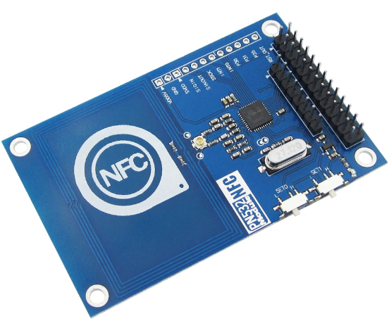

# doorPi

20180147 김민           LED, NumPad, Button, Buzzer, Servo

20180405 문지혁         NFC, Mutex, 리팩토링

20180060 권수열         BT

# 개발배경

- 최근 1인 가구의 증가로 인해 현대 사회에서 편의성이 중요해지고 있습니다. 이에따라 라즈베리파이를 이용한 IOT 도어락/홈파이를 개발했습니다.
- 문이 열리고/닫힐때 각각의 액추에이터들이 스레드를 통해 동시에 작동되게하고, 꺼지게 한다.

# 주요 기능

- NFC 인증 문열림
- NumPad 인증 문열림
- Button 문열림
- 입력 시 비프음 출력
- 입력 시 상황에 따른 LED 출력
- 문열림 시 Servo 모터 작동
- Bluetooth 출입 상황 전달

# 프로젝트 구조설명

makefile을 이용하여 다중 파일 컴파일을 실행함

doorPi의 기본이 되는 main.c파일을 비롯한 소스코드 파일들은 src폴더에, 각 함수 및 헤더가 선언되어있는 헤더 파일은 include폴더에 작성되어있음

빌드할 시에 GitHub에는 올라가지 않는 build폴더를 이용하여 오브젝트 파일들을 생성, 다중 파일 컴파일을 실행함

# 기능 상세 설명
### 1) 입실
1. NFC, NumPad 인증을 수행함, 성공 시 녹색, 실패 시 적색, NumPad 입력 시 청색을 LED로 출력하고 동시에 비프음을 출력함
2. 인증 성공 시 외부에서 출입함을 homePi에 Bluetooth로 전달함
3. Servo 모터를 작동시켜 잠금을 해제함
4. 몇초 동안 열림상태를 유지 후 다시 Servo 모터를 작동시켜 잠금
### 2) 퇴실
1. Button 입력 시 녹색 LED와 비프음을 출력함
2. 내부에서 출입함을 homePi에 Bluetooth로 전달함
3. Servo 모터를 작동시켜 잠금을 해제함
4. 몇초 동안 열림상태를 유지 후 다시 Servo 모터를 작동시켜 잠금

# 사용모듈

HW136 넘버패드 모듈 - 4x4 터치인식 숫자패드

PN532 NFC 모듈 - NFC 인식 패드 + NFC 칩

HC06 블루투스 모듈 - 시리얼 통신 블루투스 통신 모듈

CH3 RGB LED 모듈 - RGB LED 모듈

Button 모듈 - H형 버튼 모듈

# 실행방법

※ libnfc 라이브러리를 설치하여야함 ※

$ make

$ sudo ./doorPi

# 옵션

-lwiringPi
WiringPi 라이브러리를 이용하기 위한 옵션

-lnfc
nfc 라이브러리를 이용하기 위한 옵션

-I/usr/local/include/nfc
nfc 장치 파일을 불러오기 위한 옵션 (환경에 따라 다름)

-L/usr/local/lib
libnfc를 불러오기 위한 옵션

-lpthread
Pthread 라이브러리를 이용하기 위한 옵션
